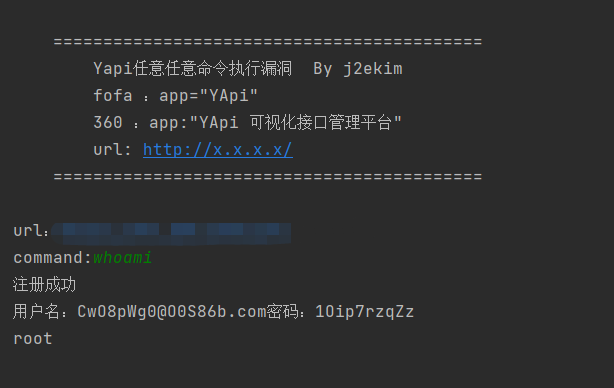

# Yapi任意命令执行漏洞利用工具
      Yapi任意任意命令执行漏洞  By j2ekim
      url: http://x.x.x.x/
      command:whoami
      

## 编写思路
   每次输入网址先判断是否开启注册，
   生成随机账户名和密码，
   注册，添加项目，添加接口，设置全局变量。
   
   漏洞详细请百度参考复现文章

## 使用需知
由于传播、利用此工具而造成的任何直接或者间接的后果及损失，均由使用者本人负责，作者不为此承担任何责任。
